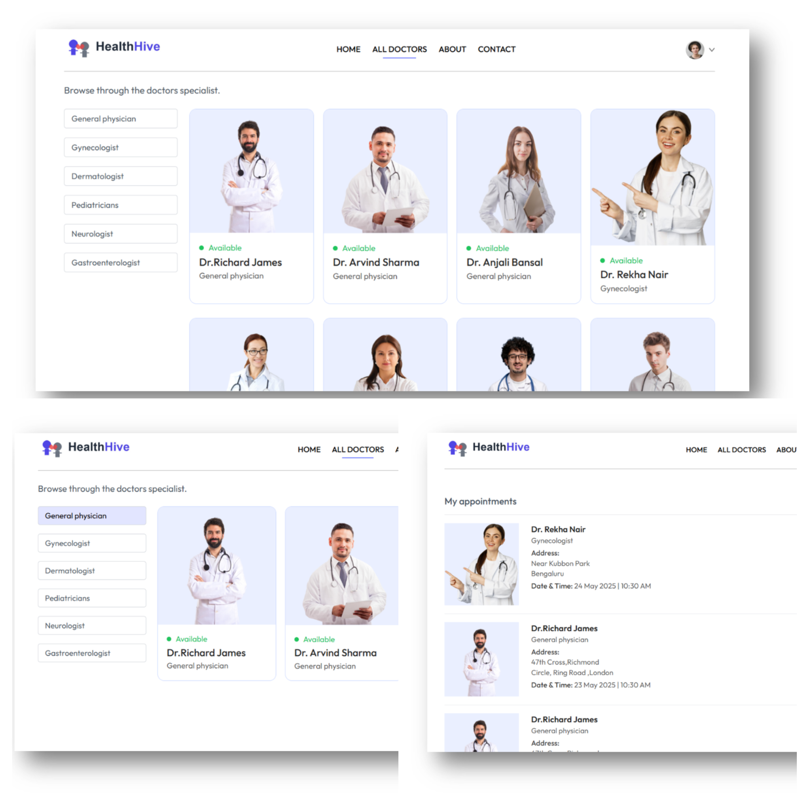
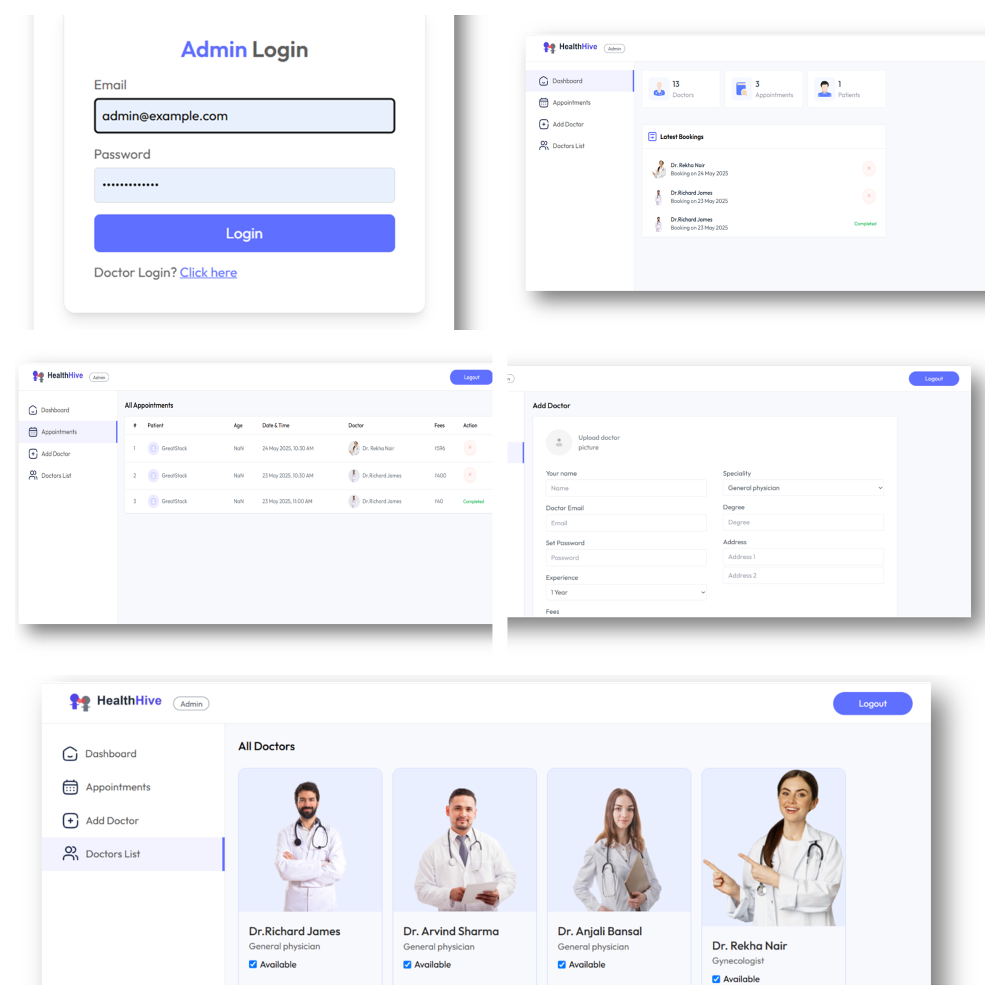

### HealthHive 🏥

**HealthHive** is a full-stack healthcare management web application built using the **MERN stack** (MongoDB, Express.js, React.js, Node.js). It aims to streamline the patient-doctor interaction by offering role-based access and secure appointment scheduling for clinics, hospitals, and independent medical professionals.

---

### 🧰 Tech Stack

## 🔑 Features

### 🔐 Authentication Module
- Role-based login for **Patients**, **Doctors**, and **Admins**
- Secure JWT-based authentication

### 🧑‍⚕️ Patient Module
- Register and manage personal profile
- Browse and filter doctors by specialization
- Book, view, cancel appointments
- Integrated online payment via **Stripe** or **Razorpay**

---

### 👨‍⚕️ Doctor Module
- Manage profile and availability
- View, confirm, or cancel patient appointments
- Dashboard overview of bookings and earnings

---

### 🛠️ Admin Module
- Admin dashboard to monitor system activity
- Manage doctor profiles and appointments
- Full control over user and system operations

---

### 💳 Payment Module
- Seamless and secure transaction process
- Integration with **Stripe** and **Razorpay**

---

:

### 📌 Conclusion
Thank you for exploring HealthHive, your comprehensive healthcare management solution designed to enhance patient-doctor interactions. Our platform leverages the MERN stack to deliver a responsive, user-friendly experience that caters to the needs of patients, doctors, and administrators alike.

### 🚀 Get Involved
We welcome contributions from developers and healthcare professionals to help us further improve and expand the features of HealthHive.
If you have suggestions, bug reports, or would like to collaborate, feel free to open an issue or submit a pull request.

